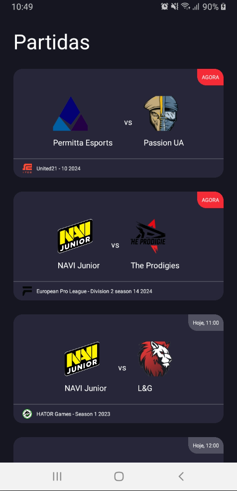
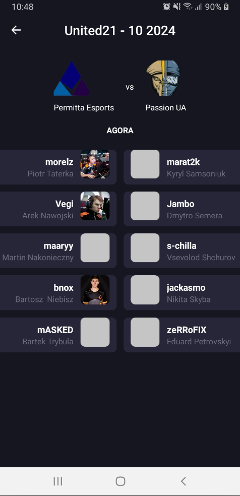

<table>
  <tr>
    <td>
      <a href="assets/final/MatchesList.png">
        
      </a>
    </td>
    <td>
      <a href="assets/final/MatchDetail.png">
        
      </a>
    </td>
  </tr>
</table>

# Introduction

> **Note**: Please note that this application is currently configured to run on Android devices. Due to the limitations of my development environment, I have tested and configured the application for Android platforms only. Unfortunately, I do not have access to macOS, which prevents me from providing direct support or testing on iOS devices. However, I have included the necessary configurations and setup steps that should enable running the application on macOS or iOS devices.

# Dependencies Used in this Project

## axios

Purpose: Axios is utilized for handling HTTP communication within the application.

Description: Axios is a popular JavaScript library used to make HTTP requests from the browser or Node.js environment. In this project, it manages communication with external APIs or backend services, facilitating the retrieval and manipulation of data.

## react-native-dotenv

Purpose: React Native Dotenv manages environment variables in the project.

Description: It allows configuration settings or sensitive data (such as API keys) to be stored securely in environment files, enhancing security and managing various configurations across development, staging, and production environments.

## styled-components

Purpose: Styled Components is employed for building UI components with styled JSX in React Native.

Description: Styled Components is a powerful library that enables writing CSS-in-JS for React and React Native applications. It helps create reusable and styled UI components by allowing the use of JavaScript to define styles, making the styling process more dynamic and efficient.

## react-native-mmkv

Purpose: React Native MMKV is utilized for managing storage within the application.

Description: It offers a simple and efficient storage solution by utilizing native key-value storage mechanisms on both iOS and Android platforms. This allows for faster access to stored data, making it ideal for managing application state or caching.

## react-native-navigation

Purpose: React Native Navigation handles screen navigations in the application.

Description: It offers a seamless and performant navigation experience by leveraging native components, ensuring smooth transitions and better user experience while navigating between different screens or sections of the app.

## date-fns

Purpose: date-fns is used for handling and formatting dates within the application.

Description: date-fns is employed to manage date-related functionality, such as formatting dates for display, parsing, calculating durations, and handling time zones. Its versatility and ease of use make it a valuable tool for managing and manipulating dates across the application.

# Running the Project

> **Note**: Before you run this project, ensure that these React Native dependencies already installed in your enviroment => JDK 17 and node >= 18.x.

You can run this project in multiple ways:

### 1. Development Mode

To run the application in development mode:

1. Add your .env file following the .env_example.
2. Open a terminal.
3. Run the following command to start the development server:

```bash
npm run start
```

3. In another terminal tab, run:

```bash
npm run android
```

### 2. Release Version

To run the release version directly on a device:

1. Add your .env file following the .env_example.

```bash
npm run android:release
```

### 3. Installing the APK

Alternatively, you can install the APK file of the app available in the main folder.
